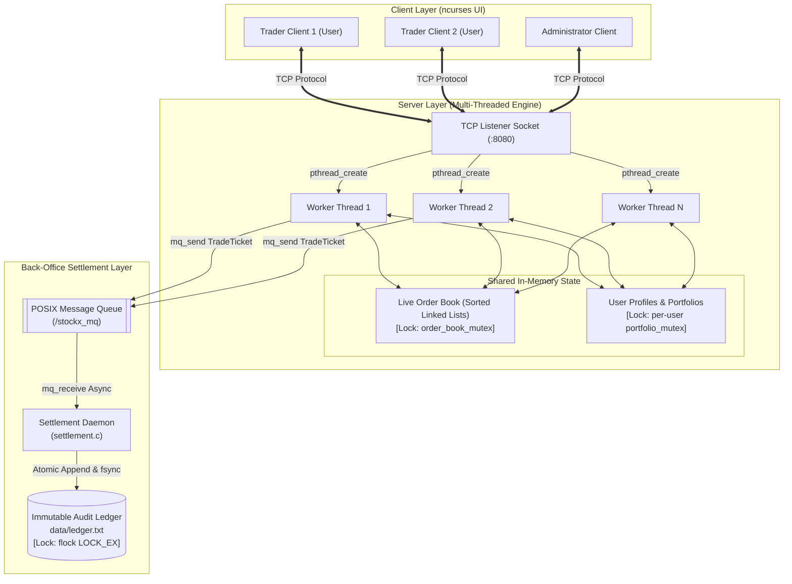

# MarketShell

**MarketShell** is an electronic financial market simulation built in C utilizing Linux POSIX system primitives. It bridges **systems programming** and **financial engineering** by implementing a deterministic  matching engine decoupled from a persistent back-office settlement pipeline via inter-process communication (IPC).

Featuring an interactive terminal dashboard built with `ncurses`, Role-Based Access Control (RBAC), and mathematical invariant guarantees (conservation of stock and cash), it demonstrates how core operating systems concepts such as multithreading, mutexes, deadlock prevention, asynchronous message queues, and memory-locked file operations are structured in financial trading infrastructure.

---


The ecosystem is structured into three asynchronous subsystems communicating over TCP Sockets and POSIX Message Queues:




## Component & File Reference

| Component | File(s) | Role & Key Responsibilities |
| :--- | :--- | :--- |
| **TCP Server Daemon** | `server.c` | Handles network socket listening, accepts concurrent client connections, spawns detached POSIX threads, manages server lifecycle, and executes clean shutdowns on `SIGINT`/`SIGTERM`. |
| **Matching Engine Core** | `engine.c`, `engine.h` | Houses the in-memory order book, user credentials, RBAC validation, linked-list sorting logic, and order matching execution. |
| **Shared Protocol Definitions** | `common.h` | Defines network messages (`Message`), inter-process payloads (`TradeTicket`), order book nodes (`Order`), user structs (`UserProfile`), and system command tokens. |
| **Client UI & Network Driver** | `client.c` | Implements the dual-window `ncurses` terminal dashboard, background polling threads for asynchronous market data refreshes, and command input parsing. |
| **Back-Office Settlement** | `settlement.c` | Dedicated daemon operating as an independent process. Consumes trade tickets via POSIX message queues and performs file-locked disk I/O. |
| **Build Automation** | `Makefile` | Compiles the toolchain with compiler optimizations (`-O2`), threading flags (`-pthread`), and required libraries (`-lrt`, `-lncurses`). |

---

## Section 1: Operating Systems & System Programming Deep Dive

The core mechanics rely on Linux OS synchronization primitives, shared memory management, and inter-process communication.

### 1. Concurrency Control & Mutex Synchronization (Semaphores)
In a multi-threaded server environment, multiple client sockets execute trades simultaneously across CPU cores. Without synchronization, race conditions would corrupt cash balances or doubly allocate stock shares. It uses fine-grained **POSIX Mutexes (`pthread_mutex_t`)** to enforce mutual exclusion:

* **Global Order Book Lock (`order_book_mutex`)**: Guards the shared singly linked lists (`bids` and `asks`). Any thread attempting to insert a limit order, traverse market data, or cancel an order must acquire this lock, ensuring atomic structural updates.
* **Per-User Portfolio Locks (`portfolio_mutex`)**: Rather than locking the global user directory during trade execution, each user profile embeds its own mutex (`UserProfile.portfolio_mutex`). This allows non-overlapping users to trade concurrently without lock contention.
* **Deadlock Prevention via Address Hierarchy**: When a trade matches between a buyer and a seller, the engine must lock *both* portfolios simultaneously. To prevent **Deadlock** cycles (e.g., Thread A locks User 1 then waits for User 2, while Thread B locks User 2 then waits for User 1), the engine deterministically acquires locks ordered by memory pointer address:
  ```c
  UserProfile *first_lock  = (buyer < seller) ? buyer : seller;
  UserProfile *second_lock = (buyer < seller) ? seller : buyer;
  if (first_lock) pthread_mutex_lock(&first_lock->portfolio_mutex);
  if (second_lock && second_lock != first_lock) pthread_mutex_lock(&second_lock->portfolio_mutex);
  ```

### 2. Inter-Process Communication (IPC) via POSIX Message Queues
To maintain high throughput, the matching engine avoids blocking on synchronous disk I/O operations when logging trade executions. It decouples the matching engine from the persistence layer using a kernel-managed **POSIX Message Queue (`/stockx_mq`)**:
* **Producer (Server Workers)**: Immediately after an order match occurs in memory, the worker thread constructs a `TradeTicket` struct and pushes it onto the kernel message queue using non-blocking `mq_send()`.
* **Consumer (Settlement Daemon)**: A separate, isolated process (`settlement`) blocks on `mq_receive()`. When the kernel signals message arrival, the daemon awakens and processes the ledger entry.

### 3. File Locking & Crash-Resilient I/O
The settlement process maintains file integrity when appending to the permanent audit ledger (`data/ledger.txt`):
* **Flocking (`flock`)**: Before writing, the process acquires an exclusive advisory lock (`LOCK_EX`) on the file descriptor. This ensures that concurrent write attempts across processes remain serialized and uncorrupted.
* **Kernel Flush (`fsync`)**: To ensure data durability against sudden system crashes, `fsync(fd)` forces the OS buffer cache to write dirty pages physically to disk storage before releasing the lock.

### 4. Dynamic Linked Lists Data Structure
The order book is implemented using dynamic singly linked lists (`Order *bids` and `Order *asks`). This data structure provides practical properties for order book management:
* **O(1) Best-Price Lookup**: The head of the `bids` list is maintained at the highest buying price, and the head of the `asks` list is maintained at the lowest selling price. Checking for a match requires evaluating `bids->price >= asks->price`.
* **Sorted Dynamic Insertion (O(N))**: When an order cannot be immediately matched, it is dynamically allocated via `malloc()` and inserted into the linked list while preserving price priority (and time priority for identical prices).
* **Memory Management**: Canceling an order traverses the linked list, unlinks the target `Order` node, refunds escrowed balances, and reclaims memory via `free()`, preventing memory leaks over extended runtimes.

---

## Section 2: Financial Engineering & Matching Engine Mechanics

It implements a **Continuous Double Auction (CDA)** matching engine structured around standard market microstructure rules.

### 1. Price-Time Priority Matching Algorithm
When a market participant submits an order, the engine evaluates it against the resting limit order book:
1. **Spread Evaluation**: A match executes if an incoming `Buy Limit Price >= Resting Ask Limit Price`, or an incoming `Sell Limit Price <= Resting Bid Limit Price`.
2. **Partial Fills**: If order quantities differ, the fill volume is calculated as `match_qty = min(incoming_qty, resting_qty)`. The resting order is decremented in place; if its remaining quantity reaches `0`, it is unlinked and freed. Any excess incoming volume continues matching against subsequent orders or rests on the book.
3. **Price Improvement (Maker-Taker Principle)**: Trades always execute at the **Maker's (resting) price**. If a trader submits a Buy order at $105.00 when the best resting Ask is $100.00, the trade executes at $100.00. The engine automatically credits the $5.00/share price difference back to the buyer's cash balance.

### 2. Pre-Trade Risk Management & Escrow Accounting
To prevent default risk, short-selling, or negative cash balances, it enforces strict pre-trade escrow accounting:
* **Cash Escrow**: When placing a limit Buy order for Q shares at price P, the engine verifies `cash_balance >= Q * P`. If valid, the required capital is deducted immediately upon order submission.
* **Stock Escrow**: When placing a limit Sell order for Q shares, the engine deducts Q shares from the user's `stock_balance` instantly upon placement.
* **Atomic Refunds**: If an active resting order is cancelled via `CMD_CANCEL`, the exact escrowed amount is unlocked and returned to the trader's available portfolio balance.

### 3. Role-Based Access Control (RBAC)
The protocol enforces separation of privileges across three distinct roles:

| Role | Permissions & Capabilities |
| :--- | :--- |
| **Trader (`User`)** | Place limit Buy/Sell orders, cancel active resting orders, query portfolio balances, and view open order history. |
| **Administrator (`Admin`)** | Issue market halts (`halt`), disconnect abusive user connections (`kick`), inspect system-wide user balances (`showdetails`), and monitor client connection counts. |
| **Spectator (`Guest`)** | Read-only access to level 2 market order book data. Denied access from order placement or portfolio execution. |

### 4. Mathematical Invariant & Solvency Verification
On graceful server termination (`SIGINT` / `SIGTERM`), the engine runs a system-wide solvency audit. It calculates the total cash and stock balances across all registered user accounts and resting order escrows, verifying conservation of initial state capital to ensure zero financial drift occurred during concurrent thread execution.

---

## Command & Network Protocol Reference

Clients communicate with the server using binary TCP message structs (`Message`). Below are the supported commands inside the client dashboard:

| Command Syntax | Allowed Roles | Description | Protocol Command |
| :--- | :--- | :--- | :--- |
| `buy <qty> <price>` | `User` | Submits a limit buy order for specified quantity and dollar price. | `CMD_BUY` |
| `sell <qty> <price>` | `User` | Submits a limit sell order for specified quantity and dollar price. | `CMD_SELL` |
| `cancel <order_id>` | `User` | Cancels an active resting limit order by ID and refunds escrow. | `CMD_CANCEL` |
| `showdetails` | `Admin` | Retrieves system-wide directory of registered traders and balances. | `CMD_SHOW_DETAILS` |
| `halt` | `Admin` | Toggles circuit breaker to halt or resume trading activity. | `CMD_HALT_TRADING` |
| `kick <username>` | `Admin` | Terminates network connection of the targeted trader. | `CMD_KICK_USER` |
| `exit` | All Roles | Terminates local client thread and closes socket connection. | *Local Disconnect* |

---

## Getting Started

### Prerequisites
* Linux operating system environment
* GCC compiler with C99 support
* `make` build utility
* `ncurses` development library (`libncurses5-dev` or `ncurses-devel`)

### Compilation
Build the system binaries (`server`, `client`, `settlement`) using the included Makefile:
```bash
make clean && make all
```

### Execution Instructions

To run the full system, open **3 separate terminal windows**:

#### Terminal 1: Start Back-Office Settlement Daemon
Start the persistence process first to initialize and listen on the POSIX message queue:
```bash
./settlement
```

#### Terminal 2: Start Matching Engine Server
Launch the server daemon on port `8080`:
```bash
./server
```

#### Terminal 3+: Launch Interactive Trader Dashboards
Connect client dashboards. You can create new accounts or log into existing ones (default built-in superuser: `admin` / Role: `Admin`):
```bash
./client
```

*Account Creation & Trading:*
1. Select `2` to create a new trader account (e.g., username: `alice`, role: `User`).
2. Open another terminal running `./client`, create a second account (e.g., `bob`), and execute matching buy and sell orders.
